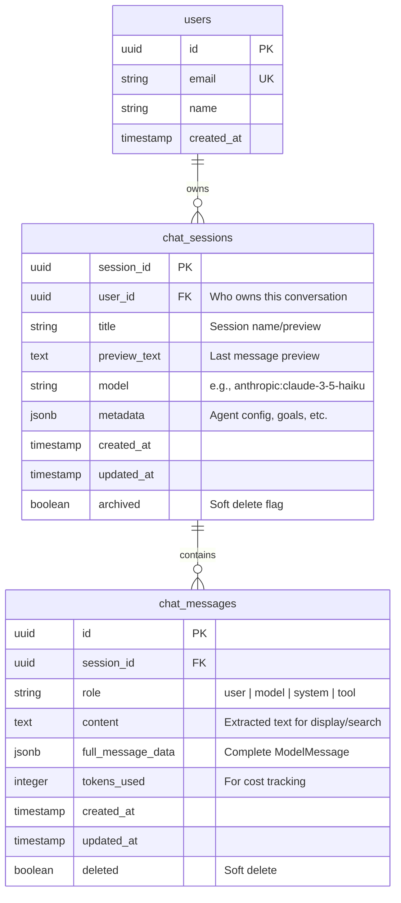

# Chat History Database Schema

This document describes the database structure for storing AI agent conversation history for the FastAPI chat application.

## Overview

The schema is designed to support:
- Multi-user chat application
- Conversation persistence and history
- Full-text search across messages
- Cost tracking and analytics
- Soft deletion for data recovery

## Entity Relationship Diagram



## Table Descriptions

### `users`
Stores user account information.

**Columns:**
- `id` (UUID, PK): Unique user identifier
- `email` (VARCHAR, UNIQUE): User's email address for authentication
- `name` (VARCHAR): Display name
- `created_at` (TIMESTAMP): Account creation time

**Purpose:** Multi-user support, auth integration

**Indexes:**
- Primary key on `id`
- Unique index on `email`

---

### `chat_sessions`
Represents individual conversations between a user and the AI agent.

**Columns:**
- `session_id` (UUID, PK): Unique conversation identifier
- `user_id` (UUID, FK): Links to users table
- `title` (VARCHAR(500)): Human-readable session name
  - Example: "October Spending Analysis"
  - Auto-generated from first user message
- `preview_text` (TEXT): Last message preview for UI display
  - Example: "You spent $45 today on groceries..."
- `model` (VARCHAR(100)): AI model used for this session
  - Example: "anthropic:claude-3-5-haiku-20241022"
- `metadata` (JSONB): Session configuration and context
  - Example: `{"financial_goals": [...], "agent_version": "1.0"}`
- `created_at` (TIMESTAMP): When conversation started
- `updated_at` (TIMESTAMP): Last message timestamp
- `archived` (BOOLEAN): Soft delete flag

**Purpose:** Organize messages into conversations, store session-level metadata

**Indexes:**
```sql
CREATE INDEX idx_sessions_user ON chat_sessions(user_id, updated_at DESC);
CREATE INDEX idx_sessions_archived ON chat_sessions(user_id, archived) WHERE NOT archived;
```

---

### `chat_messages`
Stores individual messages within conversations.

**Columns:**
- `id` (UUID, PK): Unique message identifier
- `session_id` (UUID, FK): Links to chat_sessions
- `role` (VARCHAR(20)): Message role
  - Values: `user`, `model`, `system`, `tool`
- `content` (TEXT): Extracted text content for display and search
  - Denormalized from `full_message_data` for performance
- `full_message_data` (JSONB): Complete Pydantic AI ModelMessage structure
  - Contains: parts, tool calls, timestamps, metadata
- `tokens_used` (INTEGER): Token count for cost tracking
- `created_at` (TIMESTAMP): When message was created
- `updated_at` (TIMESTAMP): Last modification time
- `deleted` (BOOLEAN): Soft delete flag

**Purpose:** Store conversation messages with full fidelity

**Indexes:**
```sql
CREATE INDEX idx_messages_session ON chat_messages(session_id, created_at);
CREATE INDEX idx_messages_search ON chat_messages USING gin(to_tsvector('english', content));
CREATE INDEX idx_messages_role ON chat_messages(session_id, role);
```

---

## Design Decisions

### 1. Session-Based Architecture

**Decision:** Separate `chat_sessions` from `chat_messages`

**Rationale:**
- Matches user mental model (conversations contain messages)
- Enables session-level metadata (title, model, config)
- Efficient loading (fetch session first, then messages)
- Clean separation for archiving/deletion

**Alternative considered:** Flat message table with session_id
- Rejected: No place for session-level data, harder to query session lists

### 2. Dual Storage: `content` + `full_message_data`

**Decision:** Store both extracted text AND full JSON

**Rationale:**
- `content`: Fast display, full-text search, SQL querying
- `full_message_data`: Preserves complete Pydantic AI structure
- Denormalization trade-off: More storage for better read performance

**Alternative considered:** Only store JSONB
- Rejected: Extracting text from JSONB is slow, full-text search harder

### 3. JSONB for Complex Data

**Decision:** Use JSONB for `full_message_data` and `metadata`

**Rationale:**
- Schema flexibility: Pydantic AI messages evolve without migrations
- Preserves structure: Tool calls, multi-part messages
- PostgreSQL benefits: Queryable, indexable, validated
- Easy serialization: Python dict ↔ JSONB ↔ Frontend JSON

**Example `full_message_data`:**
```json
{
  "role": "model",
  "parts": [
    {
      "part_kind": "text",
      "content": "You spent $45 today"
    },
    {
      "part_kind": "tool-return",
      "tool_name": "get_transactions",
      "content": {...}
    }
  ],
  "timestamp": "2025-10-27T10:30:00Z",
  "model_name": "claude-3-5-haiku"
}
```

### 4. Soft Deletion Pattern

**Decision:** Use boolean flags (`archived`, `deleted`) instead of DELETE

**Rationale:**
- Data recovery: Users can restore conversations
- Audit trail: Know what was deleted and when
- Referential integrity: No cascade deletion issues
- Analytics: Include deleted data in historical analysis

**Implementation:**
```sql
-- User archives a conversation
UPDATE chat_sessions SET archived = true WHERE session_id = ?;

-- User deletes a message
UPDATE chat_messages SET deleted = true WHERE id = ?;

-- Queries filter out deleted by default
SELECT * FROM chat_messages WHERE session_id = ? AND NOT deleted;
```

### 5. Indexing Strategy

**Decision:** Indexes optimized for common API queries

**Rationale:**
- Session list: `(user_id, updated_at DESC)` for "my recent chats"
- Message load: `(session_id, created_at)` for chronological order
- Search: GIN index on `to_tsvector(content)` for full-text search
- Role filtering: `(session_id, role)` for "show only user messages"

**Query patterns:**
```sql
-- Pattern 1: List user's sessions (sidebar)
SELECT * FROM chat_sessions 
WHERE user_id = ? AND NOT archived 
ORDER BY updated_at DESC 
LIMIT 20;

-- Pattern 2: Load conversation (main view)
SELECT * FROM chat_messages 
WHERE session_id = ? AND NOT deleted 
ORDER BY created_at ASC;

-- Pattern 3: Search messages (search bar)
SELECT * FROM chat_messages cm
JOIN chat_sessions cs ON cm.session_id = cs.session_id
WHERE cs.user_id = ? 
  AND to_tsvector('english', cm.content) @@ plainto_tsquery('english', ?)
LIMIT 20;
```

---

## Message Data Flow

### Creating a New Message

```
1. User sends message via API
   ↓
2. Load conversation history from DB
   SELECT * FROM chat_messages WHERE session_id = ? ORDER BY created_at
   ↓
3. Convert to ModelMessage objects
   ModelMessagesTypeAdapter.validate_json(full_message_data)
   ↓
4. Run Pydantic AI agent with history
   agent.run_sync(user_query, message_history=history)
   ↓
5. Get new messages from result
   new_messages = result.new_messages()  # [user_message, agent_response]
   ↓
6. Save to database
   - Extract content from ModelMessage
   - Serialize full message to JSON
   - Insert into chat_messages
   - Update chat_sessions.updated_at and preview_text
```

### Loading a Conversation

```
1. API request: GET /api/sessions/{id}/messages
   ↓
2. Query database
   SELECT * FROM chat_messages WHERE session_id = ? AND NOT deleted
   ↓
3. Return simplified format for frontend
   {
     "id": "msg-uuid",
     "role": "user",
     "content": "How much did I spend?",
     "created_at": "2025-10-27T10:30:00Z",
     "tokens_used": 45
   }
```

---

## Example Queries

### Get User's Recent Sessions with Message Counts
```sql
SELECT 
    cs.session_id,
    cs.title,
    cs.preview_text,
    cs.updated_at,
    COUNT(cm.id) as message_count
FROM chat_sessions cs
LEFT JOIN chat_messages cm ON cs.session_id = cm.session_id AND NOT cm.deleted
WHERE cs.user_id = 'user-uuid' AND NOT cs.archived
GROUP BY cs.session_id
ORDER BY cs.updated_at DESC
LIMIT 20;
```

### Get Conversation with Message Details
```sql
SELECT 
    id,
    role,
    content,
    tokens_used,
    created_at
FROM chat_messages
WHERE session_id = 'session-uuid' AND NOT deleted
ORDER BY created_at ASC;
```

### Search Across All User's Conversations
```sql
SELECT 
    cm.id,
    cm.session_id,
    cs.title,
    cm.content,
    cm.created_at,
    ts_rank(to_tsvector('english', cm.content), plainto_tsquery('english', 'spending')) as rank
FROM chat_messages cm
JOIN chat_sessions cs ON cm.session_id = cs.session_id
WHERE cs.user_id = 'user-uuid'
  AND to_tsvector('english', cm.content) @@ plainto_tsquery('english', 'spending')
ORDER BY rank DESC, cm.created_at DESC
LIMIT 20;
```

### Calculate Total Token Usage
```sql
SELECT 
    cs.session_id,
    cs.title,
    SUM(cm.tokens_used) as total_tokens,
    COUNT(cm.id) as message_count
FROM chat_sessions cs
JOIN chat_messages cm ON cs.session_id = cm.session_id
WHERE cs.user_id = 'user-uuid'
  AND cm.created_at >= NOW() - INTERVAL '30 days'
GROUP BY cs.session_id, cs.title
ORDER BY total_tokens DESC;
```

---

## Migration Path from Simple Schema

If you started with the simple schema (just `chat_sessions` and `chat_messages`), here's how to migrate:

### Phase 1: Add User Support
```sql
-- 1. Create users table
CREATE TABLE users (...);

-- 2. Add user_id to chat_sessions
ALTER TABLE chat_sessions ADD COLUMN user_id UUID REFERENCES users(id);

-- 3. Create default user and assign existing sessions
INSERT INTO users (id, email, name) VALUES 
  ('default-user-uuid', 'default@example.com', 'Default User');
UPDATE chat_sessions SET user_id = 'default-user-uuid';

-- 4. Make user_id required
ALTER TABLE chat_sessions ALTER COLUMN user_id SET NOT NULL;
```

### Phase 2: Add Session Metadata
```sql
ALTER TABLE chat_sessions 
  ADD COLUMN title VARCHAR(500),
  ADD COLUMN preview_text TEXT,
  ADD COLUMN model VARCHAR(100),
  ADD COLUMN metadata JSONB,
  ADD COLUMN archived BOOLEAN DEFAULT FALSE;

-- Populate from existing data
UPDATE chat_sessions cs
SET 
  title = SUBSTRING(first_msg.content FROM 1 FOR 100),
  preview_text = last_msg.content
FROM (
  SELECT session_id, content 
  FROM chat_messages 
  WHERE role = 'user' 
  ORDER BY created_at ASC
) first_msg
JOIN (
  SELECT session_id, content 
  FROM chat_messages 
  ORDER BY created_at DESC 
  LIMIT 1
) last_msg ON first_msg.session_id = last_msg.session_id
WHERE cs.session_id = first_msg.session_id;
```

### Phase 3: Enhance Messages
```sql
ALTER TABLE chat_messages
  ADD COLUMN role VARCHAR(20),
  ADD COLUMN content TEXT,
  ADD COLUMN tokens_used INTEGER,
  ADD COLUMN deleted BOOLEAN DEFAULT FALSE;

-- Rename existing column
ALTER TABLE chat_messages RENAME COLUMN message_data TO full_message_data;

-- Populate role and content from JSON
UPDATE chat_messages
SET 
  role = full_message_data->>'role',
  content = full_message_data->'parts'->0->>'content';
```

---

## Future Enhancements

### 1. Message Reactions/Feedback
```sql
CREATE TABLE message_feedback (
    id UUID PRIMARY KEY,
    message_id UUID REFERENCES chat_messages(id),
    user_id UUID REFERENCES users(id),
    feedback_type VARCHAR(20),  -- 'thumbs_up', 'thumbs_down', 'helpful'
    comment TEXT,
    created_at TIMESTAMP DEFAULT NOW()
);
```

### 2. Shared Sessions
```sql
CREATE TABLE session_shares (
    id UUID PRIMARY KEY,
    session_id UUID REFERENCES chat_sessions(session_id),
    shared_by UUID REFERENCES users(id),
    shared_with UUID REFERENCES users(id),
    permission VARCHAR(20),  -- 'read', 'write'
    created_at TIMESTAMP DEFAULT NOW()
);
```

### 3. Session Tags/Categories
```sql
CREATE TABLE session_tags (
    session_id UUID REFERENCES chat_sessions(session_id),
    tag VARCHAR(50),
    created_at TIMESTAMP DEFAULT NOW(),
    PRIMARY KEY (session_id, tag)
);

CREATE INDEX idx_tags ON session_tags(tag);
```

### 4. Cost Tracking
```sql
CREATE TABLE usage_metrics (
    id UUID PRIMARY KEY,
    session_id UUID REFERENCES chat_sessions(session_id),
    message_id UUID REFERENCES chat_messages(id),
    model VARCHAR(100),
    input_tokens INTEGER,
    output_tokens INTEGER,
    estimated_cost DECIMAL(10, 6),
    created_at TIMESTAMP DEFAULT NOW()
);
```

---

## Performance Considerations

### Read Performance
- **Indexes on foreign keys**: Fast joins
- **Denormalized content**: No JSON parsing for display
- **Partial indexes**: Exclude archived/deleted from common queries
- **LIMIT clauses**: Always paginate large result sets

### Write Performance
- **Batch inserts**: Insert multiple messages in one transaction
- **Async updates**: Update session.updated_at asynchronously
- **Connection pooling**: Reuse database connections

### Storage Optimization
- **JSONB compression**: PostgreSQL automatically compresses large JSONB
- **Archival strategy**: Move old sessions to cold storage after 1 year
- **Vacuum regularly**: Reclaim space from updated/deleted rows

---

## Security Considerations

### Row-Level Security
```sql
-- Enable RLS
ALTER TABLE chat_sessions ENABLE ROW LEVEL SECURITY;
ALTER TABLE chat_messages ENABLE ROW LEVEL SECURITY;

-- Policy: Users can only access their own sessions
CREATE POLICY user_sessions ON chat_sessions
    FOR ALL TO authenticated_user
    USING (user_id = current_user_id());

-- Policy: Users can only access messages from their sessions
CREATE POLICY user_messages ON chat_messages
    FOR ALL TO authenticated_user
    USING (
        session_id IN (
            SELECT session_id FROM chat_sessions WHERE user_id = current_user_id()
        )
    );
```

### Data Privacy
- **PII handling**: Consider encrypting sensitive data in `full_message_data`
- **Retention policy**: Auto-delete archived sessions after N days
- **Audit logging**: Track who accessed what and when
- **GDPR compliance**: Provide data export and deletion endpoints

---

## Testing Strategy

### Unit Tests
- Serialization: ModelMessage ↔ JSON ↔ Database
- Constraints: Verify foreign keys, check constraints
- Soft deletion: Ensure deleted data is filtered out

### Integration Tests
- Session lifecycle: Create → Update → Archive → Restore
- Message flow: Send → Store → Retrieve → Display
- Search: Full-text search accuracy

### Performance Tests
- Load 1000 messages: Should be < 100ms
- Search 10,000+ messages: Should be < 200ms
- Concurrent writes: Handle 100 simultaneous users

